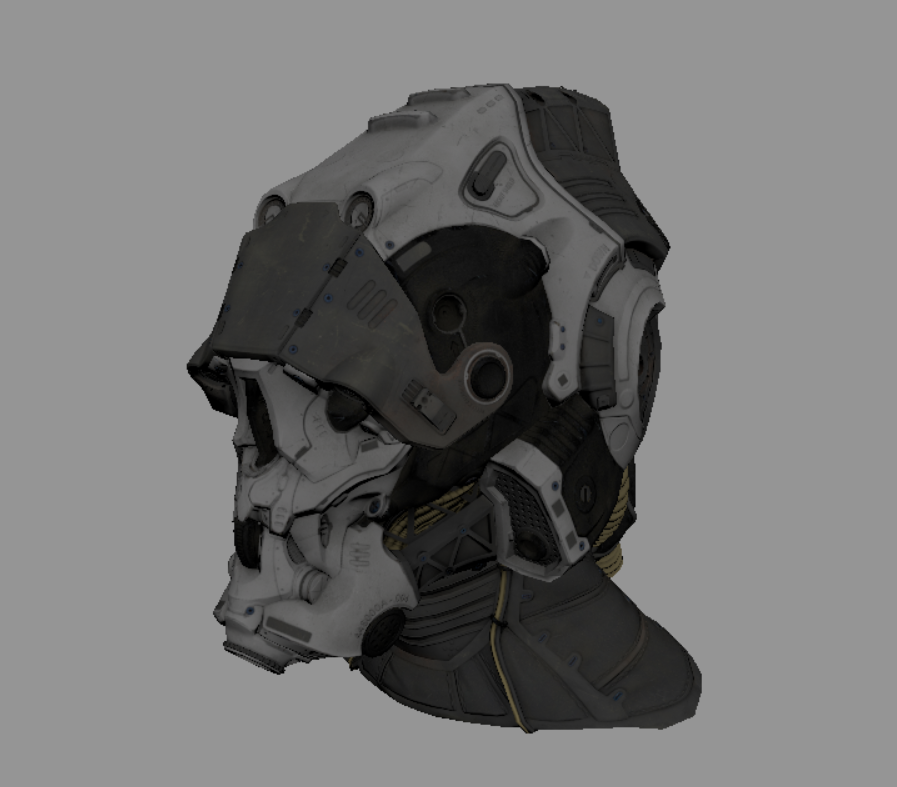

# NickelEngine

An opensource, data-oriented ECS game engine.

## How-To-Build

use cmake:

```bash
git submodule update --init --recursive
cmake -S . -B cmake-build
cmake --build cmake-build
```

Under Windows, if cmake can't find SDL, you should set `SDL2_ROOT` to your SDL path:

```bash
cmake -S . -B cmake-build -DSDL2_ROOT=<your-sdl2-path>
```

in some system, you may want to copy needed dll to your output dir, use:

```bash
cmake -S . -B cmake-build -DNICKEL_COPYDLL=ON
```

to enable auto copy dlls.

**Each program should run at project root path**

## 3rd Libraries

|library|description|
|--|--|
|[SDL2](https://github.com/libsdl-org/SDL)| use to support create window, render context and basic input|
|[gecs](https://github.com/VisualGMQ/gecs.git)| basic ECS framework|
|[mirrow](https://github.com/VisualGMQ/mirrow.git)| TMP framework, use to do dynamic/static reflection and serialization|
|[stb_image](http://nothings.org/stb)| use to loading images|
|[glad](https://glad.dav1d.de/)| use to load opengl|
|[Vulkan](https://www.vulkan.org/)| Vulkan1.3 |
|[dear-imgui](https://github.com/ocornut/imgui)| use to support GUI in editor|
|[miniaudio](https://miniaud.io/)| use to play audio cross platform|
|[nanobench](https://nanobench.ankerl.com/)| use to do benchmark|
|[nameof](https://github.com/Neargye/nameof)| use to get enum name convniently|
|[freetype2](https://freetype.org/)| use to render ttf font|
|[lunasvg](https://github.com/sammycage/lunasvg)| use to render svg|
|[rapidxml](https://rapidxml.sourceforge.net/)| use to parse XML|
|[tomlplusplus](https://github.com/marzer/tomlplusplus)| use to support toml file parse|
|[esfw](https://github.com/SpartanJ/efsw)| use to watch file changing in editor|
|[easy_profiler](https://github.com/yse/easy_profiler)|use to profile|

editor icon: [vscode-material-icon-theme](https://github.com/PKief/vscode-material-icon-theme)

## Features

- [x] 2D renderer based on OpenGL4
- [ ] 3D renderer(currently only in rhi example)
    - [x] gltf2.0 load&display(not full support)
    - [x] defered rendering
    - [x] skybox
- [x] Data Oriented based on ECS
- [x] Animation applyed on arbitary properties
- [x] Text render with UTF8 encoding
- [x] Prefab save/load
- [ ] UI(WIP)
- [ ] Game physics(WIP)
- [x] RHI covered OpenGL4 and Vulkan
    - [x] vulkan layer
    - [x] GL4.3 layer(Only For Fun)
- [ ] Game sound playing(WIP)
- [x] 3D rendering
    - [x] glTF2.0 support(not full support yet)
- [ ] Scene change/load/save
    - [x] scene save/load
    - [ ] multiple scene
    - [ ] scene change
- [ ] script
    - [ ] cpp(dynamic library)
    - [ ] lua/quickJs/C#mono (don't determine currently)

## Editor

* features:
    - [x] Entity list window
        - [x] show entities
        - [x] drag entity to reorder/set hierarchy
    - [x] Inspector window to show components of selected entity
    - [x] Game scene display
    - [x] Tilesheet Editor
    - [x] Assets window
        - [x] show assets
        - [x] load/release asset
        - [ ] asset property window
            - [x] texture asset property window
            - [x] font asset property window
            - [x] audio asset property window
            - [ ] script asset property window
    - [x] Animation editor
    - [x] Project Save/Load
        - [x] asset save/load
        - [x] scene(entities) save/load

## snapshots





